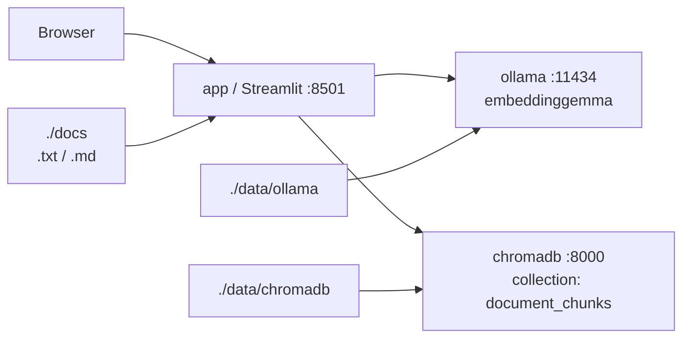

# ChromaDB + Ollama + Streamlit 文書検索デモ

ChromaDB、Ollama、Streamlit を Docker Compose で起動し、`docs/` 配下の `.txt` / `.md` 文書を Embedding 化して意味検索と仮想グラフビューを表示するデモです。

グラフDBとしての永続的なリレーションは作りません。PyVis の線は検索結果の Embedding 類似度から UI 側で動的に作る一時的な仮想リンクです。

## 1. 起動方法

```bash
docker compose up -d --build
```

起動状況を確認します。

```bash
docker compose ps
```

アクセス先:

- Streamlit: [http://localhost:8501](http://localhost:8501)
- ChromaDB: [http://localhost:8000](http://localhost:8000)
- Ollama: [http://localhost:11434](http://localhost:11434)

## 2. embeddinggemma の pull 方法

初回起動後、Ollama コンテナに `embeddinggemma` を pull してください。

```bash
docker exec -it rag-ollama ollama pull embeddinggemma
```

モデル取得後、必要に応じて Streamlit アプリを再起動します。

```bash
docker compose restart app
```

## 3. 文書取り込み方法

1. `docs/` 配下に `.txt` または `.md` ファイルを配置します。
2. Streamlit を開きます: [http://localhost:8501](http://localhost:8501)
3. 左サイドバーの「チャンク設定」を必要に応じて変更します。
4. 左サイドバーの「文書を取り込む」ボタンを押します。
5. 文書がチャンク化され、Ollama の `embeddinggemma` で Embedding が生成されます。
6. ChromaDB の `document_chunks` collection にチャンク本文、Embedding、メタデータが保存されます。

同じファイルを再取り込みしても重複しにくいよう、chunk id は `ファイルパス + chunk_index` から安定生成し、ChromaDB へ upsert します。
チャンク設定を変えて再取り込みする場合は、古い分割結果との混在を避けるため「取り込み前にChromaDBをリセット（推奨）」をONにしてください。デフォルトはONです。

## 4. チャンク設定

サイドバーで Dify 風のチャンク設定を指定できます。

- `チャンク区切り文字`: デフォルトは `\n\n` です。空行ごとに分割します。
- `正規表現として扱う`: ON にすると区切り文字を正規表現として扱います。
- `最大チャンク長（文字数）`: 1チャンクに許容する最大文字数です。デフォルトは `500`、最大は `4000` です。
- `チャンクのオーバーラップ（文字数）`: チャンク間に重複させる文字数です。Dify と同様に、チャンク長の10〜25%程度を推奨します。

例:

- `\n\n`: 空行ごとに分割します。
- `。`: 句点ごとに分割します。
- 正規表現ONで `。|！|？`: 複数の文末記号で分割します。

## 5. 検索方法

1. メイン画面の検索ボックスに検索文を入力します。
2. サイドバーで `TopK` を指定します。
3. 「検索実行」ボタンを押します。
4. 検索文を Ollama の `embeddinggemma` で Embedding 化します。
5. ChromaDB で近いチャンクを TopK 検索します。
6. 検索結果一覧に `title`、`path`、`chunk_index`、`distance`、`score`、チャンク本文が表示されます。

## 6. グラフビュー仕様

- ChromaDB にはリンクやリレーションは保存しません。
- 検索結果 TopK のチャンクをノードとして表示します。
- 検索結果同士の Embedding cosine 類似度をアプリ側で計算します。
- サイドバーの「グラフ表示用の類似度閾値」以上の組み合わせだけ、PyVis の仮想エッジとして描画します。
- ノードにはファイル名と `chunk_index` を表示します。
- ノード詳細には `path` とチャンク本文の先頭数百文字を表示します。
- エッジには類似度スコアを表示します。

## 全体構成



サービス構成:

- `chromadb`: ベクトル検索用ストア。`8000` を公開します。
- `ollama`: Embedding 生成。`11434` を公開し、`embeddinggemma` を利用します。
- `app`: Streamlit アプリ。`8501` を公開し、文書取り込み、検索、仮想グラフビューを提供します。

データ保存:

- `./docs` は app コンテナの `/app/docs` に read-only でマウントします。
- `./data/chromadb` は ChromaDB の永続データです。
- `./data/ollama` は Ollama のモデルと設定です。

## ディレクトリ構成

```text
.
├─ docker-compose.yml
├─ README.md
├─ docs/
│  └─ サンプル文書
└─ app/
   ├─ Dockerfile
   ├─ requirements.txt
   ├─ main.py
   ├─ chroma_client.py
   ├─ ollama_client.py
   ├─ ingest.py
   └─ graph_view.py
```

## ChromaDB に保存するデータ

- collection: `document_chunks`
- id: chunk の一意ID
- document: チャンク本文
- embedding: `embeddinggemma` で生成したベクトル
- metadata:
  - `document_id`
  - `title`
  - `path`
  - `chunk_index`
  - `source_type`
  - `chunk_separator`
  - `chunk_separator_is_regex`
  - `chunk_size`
  - `chunk_overlap`

## 停止方法

```bash
docker compose down
```

データも削除する場合:

```bash
rm -rf data/chromadb data/ollama
```
