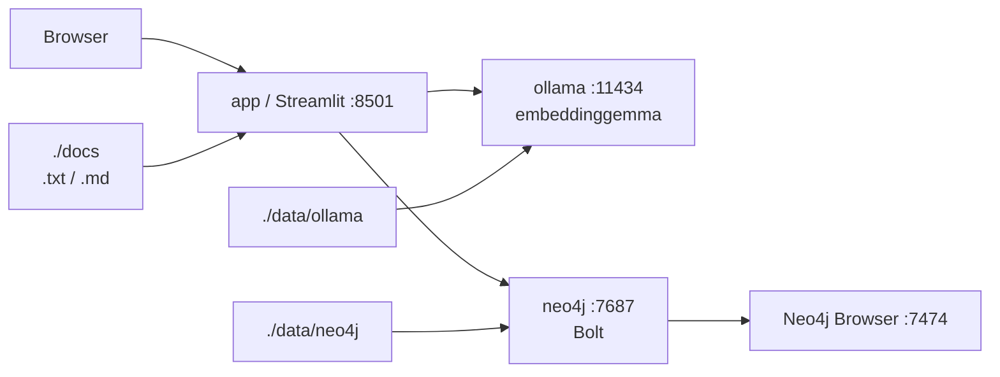

# Neo4j + Ollama + Streamlit 文書検索デモ

Neo4j、Ollama、Streamlit を Docker Compose で起動し、`docs/` 配下の文書を Embedding 化して意味検索とグラフビューを表示するデモです。

既存の `docs/` サンプルを使います。アプリは `.txt` に加えて、現在配置済みのサンプルをそのまま試せるよう `.md` もプレーンテキストとして読み込みます。PDF / Word は対象外です。

## 1. 起動方法

```bash
docker compose up -d --build
```

起動状況を確認します。

```bash
docker compose ps
```

## 2. embeddinggemma の pull 方法

初回起動後、Ollama コンテナに `embeddinggemma` を pull してください。

```bash
docker exec -it rag-ollama ollama pull embeddinggemma
```

モデル取得後、必要に応じて Streamlit アプリを再起動します。

```bash
docker compose restart app
```

## 3. 文書取り込み方法

1. Streamlit を開きます: [http://localhost:8501](http://localhost:8501)
2. 左サイドバーの「文書を取り込む」ボタンを押します。
3. `docs/` 配下の `.txt` / `.md` が読み込まれます。
4. 文書、チャンク、Embedding、Chunk 間類似、Document 間類似、簡易 Entity が Neo4j に保存されます。

取り込みはデモ向けに既存グラフを削除して再作成します。

## 4. 検索方法

1. Streamlit の「意味検索」に検索文を入力します。
2. 入力文を Ollama の `embeddinggemma` で Embedding 化します。
3. Neo4j のベクトルインデックス `chunk_embedding_index` から近い `Chunk` を取得します。
4. 結果には文書タイトル、チャンク本文、類似度スコア、文書パスが表示されます。
5. 「詳細・グラフビュー」ページでも検索でき、検索結果を選択すると詳細と PyVis のグラフビューが表示されます。

## 5. Neo4j Browser の開き方

Neo4j Browser は以下から開けます。

[http://localhost:7474](http://localhost:7474)

ログイン情報:

- Username: `neo4j`
- Password: `password`
- Bolt URL: `bolt://localhost:7687`

確認用 Cypher:

```cypher
MATCH (d:Document)-[:HAS_CHUNK]->(c:Chunk)
RETURN d.title, c.chunkIndex, left(c.text, 120) AS chunk
LIMIT 20;
```

## 6. Streamlit 画面の開き方

Streamlit は以下から開けます。

[http://localhost:8501](http://localhost:8501)

## 全体構成

このデモは Docker Compose で `neo4j`、`ollama`、`app` の3サービスを起動します。



処理の流れ:

1. `docs/` 配下の `.txt` / `.md` を Streamlit アプリが読み込みます。
2. 文書をチャンク化し、Ollama の `embeddinggemma` で Embedding を生成します。
3. `Document`、`Chunk`、`Entity`、類似関係を Neo4j に保存します。
4. 検索時は検索文を Embedding 化し、Neo4j のベクトルインデックスで近い `Chunk` を取得します。
5. 詳細・グラフビューでは、選択した `Chunk` を中心に `Document`、類似 `Chunk`、`Entity` を PyVis で表示します。

サービス構成:

- `neo4j`: グラフデータベース。`7474` で Browser、`7687` で Bolt を公開します。
- `ollama`: Embedding 生成。`11434` を公開し、`embeddinggemma` を利用します。
- `app`: Streamlit アプリ。`8501` を公開し、文書取り込み、検索、グラフビューを提供します。

データ保存:

- `./docs` は app コンテナの `/app/docs` に read-only でマウントします。
- `./data/neo4j/data` と `./data/neo4j/logs` は Neo4j の永続データです。
- `./data/ollama` は Ollama のモデルと設定です。
- Docker named volume は使用していません。

## ディレクトリ構成

```text
.
├─ .gitignore
├─ docker-compose.yml
├─ README.md
├─ data/
│  ├─ neo4j/
│  │  ├─ data/
│  │  └─ logs/
│  └─ ollama/
├─ docs/
└─ app/
   ├─ Dockerfile
   ├─ requirements.txt
   ├─ main.py
   ├─ search_page.py
   ├─ detail_graph_page.py
   ├─ ui_common.py
   ├─ neo4j_client.py
   ├─ ollama_client.py
   ├─ ingest.py
   └─ graph_view.py
```

アプリ内のページ:

- `意味検索`: 検索文を入力し、ベクトル検索結果を一覧表示します。
- `詳細・グラフビュー`: このページ単体でも検索でき、選択した Chunk の詳細と周辺グラフを表示します。

## データモデル

- `(:Document {id, title, path, text})`
- `(:Chunk {id, text, chunkIndex, embedding})`
- `(:Entity {name, type})`
- `(:Document)-[:HAS_CHUNK]->(:Chunk)`
- `(:Chunk)-[:SIMILAR {score}]->(:Chunk)`
- `(:Document)-[:SIMILAR {score}]->(:Document)`
- `(:Chunk)-[:MENTIONS]->(:Entity)`

## 停止方法

```bash
docker compose down
```

Neo4j と Ollama のデータは named volume ではなく、ホスト側の以下に保存されます。

```bash
data/neo4j/data
data/neo4j/logs
data/ollama
```

データも削除する場合:

```bash
rm -rf data
```
